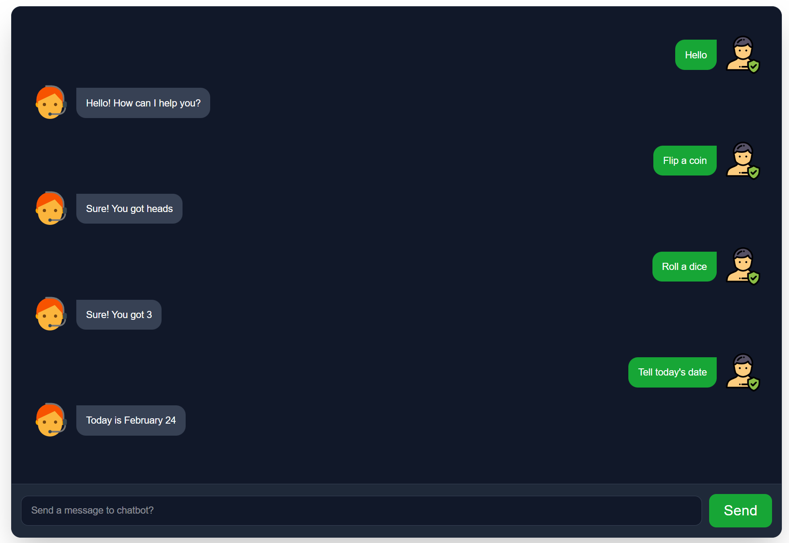

# Basic React Chatbot

This chatbot has been created using React (with Vite) and TailwindCSS (mobile first approach). The default chabot responses are from boilerplate "chabot.js" imported using npm.

## Functionalities include;

- Gretting the user
- Flipping a coin
- Roll a dice
- Tell today's date

